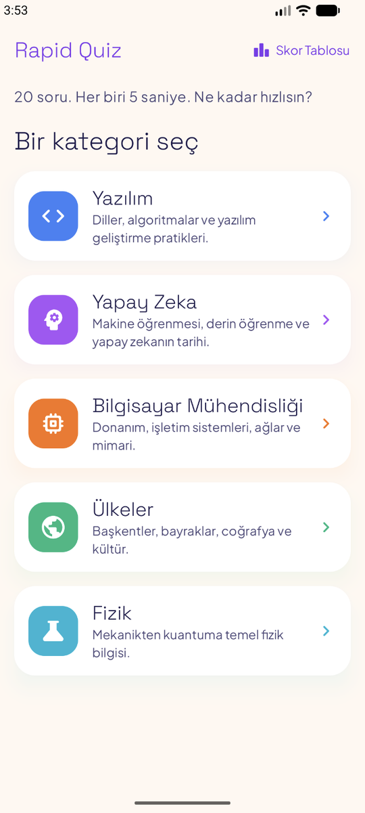
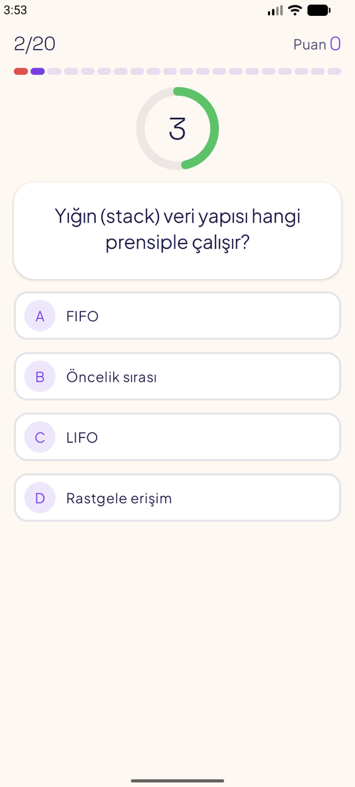
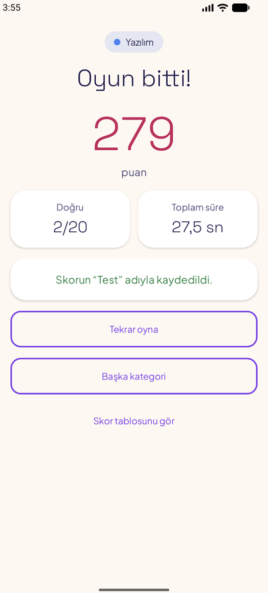
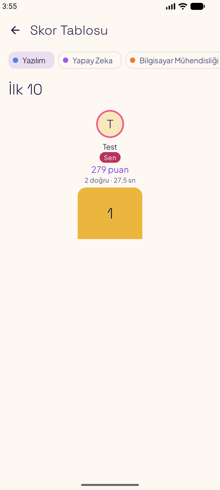

[🇬🇧 English](README.md) | 🇹🇷 Türkçe

# Rapid Quiz — Android

Hızlı bir bilgi yarışmasının yerel Android istemcisi: **20 soru, her soru için 5 saniye, üyelik yok** ve **kategori bazlı İlk 10 skor tablosu**. Kotlin ve Jetpack Compose ile yazıldı.

<table>
  <tr>
    <th align="center">Kategoriler</th>
    <th align="center">Oyun</th>
    <th align="center">Sonuç</th>
    <th align="center">Skor Tablosu</th>
  </tr>
  <tr>
    <td></td>
    <td></td>
    <td></td>
    <td></td>
  </tr>
</table>

> **Rapid Quiz'in bir parçası**
>
> | Repo | Rolü |
> | --- | --- |
> | [RapidQuizBackend](https://github.com/busracankit/RapidQuizBackend) | Django REST API: oyun mantığı, puanlama, skor tabloları |
> | [RapidQuizFrontend](https://github.com/busracankit/RapidQuizFrontend) | Web istemcisi (Vue 3 + TypeScript) |
> | [RapidQuizAndroid](https://github.com/busracankit/RapidQuizAndroid) | Android istemcisi (Kotlin + Jetpack Compose, bu repo) |
>
> Canlı bir sunucu yok. Uygulama, yerelde çalıştırdığın backend'e bağlanır (bkz. [Kurulum ve çalıştırma](#kurulum-ve-çalıştırma)). Bir alan adı planlanmıştı ama hiç satın alınmadı.

## Özellikler

- **Web istemcisinden birebir aktarılan dört ekran:**
  - **Kategoriler:** kategori kartları, yükleniyor iskeleti, "Tekrar dene" içeren hata ekranı.
  - **Oyun:** 3-2-1 geri sayım, 5 saniyelik dairesel sayaç, 20 parçalı ilerleme çubuğu, A/B/C/D şıklar, doğru/yanlış geri bildirimi ve kazanılan puan.
  - **Sonuç:** sayarak artan puan, doğru sayısı, toplam süre ve isimle skor kaydı.
  - **Skor Tablosu:** kategori seçici, ilk 3 podyum, 4–10. sıralar, oyuncunun kendi satırı vurgulu, İlk 10 dışındaysa "Senin sıran: N."
- Web sürümüyle aynı API, kurallar, metinler (Türkçe arayüz) ve renk paleti.
- Kesintilere dayanıklı: uygulamanın arka plana alınması, geri tuşu (çıkmadan önce onay sorulur), ağ hataları ve süresi dolan oturum.
- Erişilebilirlik: ekran okuyucu için başlıklar ve etiketler, dokunsal geri bildirim, küçük ekran desteği. Sistemde "animasyonları kaldır" açıksa süs animasyonları kapanır.

## Teknolojiler

| Alan | Araçlar |
| --- | --- |
| Dil ve arayüz | Kotlin 2.4, Jetpack Compose (BOM 2026.09), Material 3 |
| Mimari | `ViewModel` + `StateFlow`, tip güvenli `@Serializable` rotalarla Navigation Compose, elle bağımlılık kabı (Hilt yok) |
| Ağ | Retrofit 3, OkHttp 5, kotlinx.serialization |
| Build | Gradle 9.6 (Kotlin DSL, version catalog), AGP 9.4, R8, `minSdk 26`, `targetSdk 37`, Java 17 |
| Test | JUnit 4, kotlinx-coroutines-test (sanal zaman), OkHttp MockWebServer, Compose UI test |

Fontlar Space Grotesk ve Plus Jakarta Sans. SIL Open Font License ile uygulamaya gömülüdür (bkz. [`docs/licenses/`](docs/licenses/)).

## Mimari ve önemli tasarım kararları

- **Bilinçli olarak ince istemci.** Puanı, süreyi ve cevabın doğru olup olmadığını sunucu belirler. Uygulama yalnızca sonucu gösterir, doğru cevap da ancak oyuncu cevap verdikten sonra gelir.
- **Monoton saatle zamanlama.** Sunucu her soruyla birlikte `starts_in_ms` ve `remaining_ms` döner. Uygulama başlangıç anını yanıt geldiği anda bir kez hesaplar (`SystemClock.elapsedRealtime() + starts_in_ms`). Cihazın duvar saatini ve sunucu zaman damgasını hiç kullanmaz, bu yüzden telefonun saati yanlış olsa da oyun etkilenmez.
- **Çift bekleme yok.** Cevaptan sonraki geri bildirim süresi sıradaki sorunun `starts_in_ms` değerinden gelir, uygulama üstüne ek bekleme koymaz. Web sürümünün eski bir halinde bu süre iki kez bekleniyordu ve oyuncu her soruda yaklaşık 0,8 saniye kaybediyordu.
- **Açık bir durum makinesi.** Oyun ViewModel'i net aşamalardan geçer (`Starting → Countdown → Playing → Answering → Feedback → … → Finished`, ayrıca `AnswerFailed`, `Syncing` ve `Error`). Cevap yalnızca `Playing` aşamasında kabul edilir, bu da çift dokunmayı engeller.
- **Tahmin değil senkron.** Uygulama arka plana geçince sayaç durur. Geri dönüldüğünde uygulama `GET /current/` çağırır ve sunucudaki durumdan devam eder.
- **Oturum anahtarı güvenliği.** `X-Session-Token` yalnızca bellekte tutulur. Diske yazılmaz, istek gövdeleri ve başlıkları loglanmaz.
- **Süre dolunca doğru JSON.** Süre dolduğunda uygulama `"choice_id": null` alanını açıkça göndermek zorundadır, çünkü backend eksik alanı reddeder. Bu durum bir birim testiyle güvence altında.
- **Ayarlanabilir sunucu adresi.** Base URL, Gradle özellikleriyle belirlenen `BuildConfig.API_BASE_URL` değerinden okunur. Düz HTTP yalnızca debug build'de ve yalnızca `10.0.2.2` ile `localhost` için açıktır (`app/src/debug/res/xml/network_security_config.xml`). Release build yalnızca HTTPS kullanır.
- **Baştan test edilebilir tasarım.** Saat (`MonotonicClock`) ve repository (`QuizRepository`) ViewModel'lere dışarıdan verilen arayüzlerdir. Böylece zamanlama mantığı gerçek bekleme ya da gerçek sunucu yerine sanal zaman ve sahte repository ile test edilir.

## API

Uygulama [RapidQuizBackend](https://github.com/busracankit/RapidQuizBackend) REST API'sini kullanır (`/api/v1/`): `categories/`, `sessions/`, `sessions/{id}/answers/`, `sessions/{id}/current/`, `sessions/{id}/result/`, `sessions/{id}/score/` ve `leaderboard/?category=`. Retrofit arayüzü `data/api/RapidQuizApi.kt` dosyasında. İstek ve yanıt örnekleriyle tam sözleşme [`docs/PROJE.md`](docs/PROJE.md) içinde.

## Kurulum ve çalıştırma

**Gerekenler:** Android Studio (en güncel kararlı sürüm) ve bir emülatör. Gerçek verilerle oynamak için backend'in de yerelde çalışıyor olması gerekir.

**1. Backend'i başlat.** [Backend README'sindeki](https://github.com/busracankit/RapidQuizBackend/blob/main/README.tr.md#kurulum-ve-çalıştırma) adımları izle. Emülatör için iki ayar önemli:

```bash
# RapidQuizBackend/.env içinde: emülatör bilgisayarına 10.0.2.2 adresiyle ulaşır
DJANGO_ALLOWED_HOSTS=localhost,127.0.0.1,0.0.0.0,10.0.2.2

# yalnızca 127.0.0.1'i değil, tüm arayüzleri dinle
uv run manage.py runserver 0.0.0.0:8000
```

Bağlantıyı kontrol etmek için emülatörün tarayıcısında `http://10.0.2.2:8000/api/v1/health/` adresini aç. `{"status":"ok"}` dönmeli.

**2. Uygulamayı çalıştır.**

```bash
git clone https://github.com/busracankit/RapidQuizAndroid.git
```

Projeyi Android Studio'da aç, Gradle senkronizasyonunu bekle ve `app` yapılandırmasını emülatörde çalıştır. Debug build varsayılan olarak `http://10.0.2.2:8000/` adresine bağlanır.

**Sunucu adresini değiştirmek** (kod değişikliği gerekmez):

| Build | Varsayılan | Değiştirmek için |
| --- | --- | --- |
| debug | `http://10.0.2.2:8000/` | `~/.gradle/gradle.properties` içinde `rapidquiz.debugApiBaseUrl=…` |
| release | yok (zorunlu) | `./gradlew assembleRelease -Prapidquiz.releaseApiBaseUrl=https://…/` |

Yayında bir sunucu olmadığı için release build'de adres açıkça verilmelidir. Verilmezse build, bağlanamayan bir uygulama üretmek yerine anlaşılır bir mesajla durur.

Aynı Wi-Fi'deki gerçek bir telefon için `rapidquiz.debugApiBaseUrl=http://<bilgisayarının-ip'si>:8000/` yaz. Sonra o IP'yi `network_security_config.xml` dosyasına ve backend'deki `DJANGO_ALLOWED_HOSTS` değerine ekle.

## Testleri çalıştırma

```bash
./gradlew testDebugUnitTest            # birim testleri (sunucu gerekmez)
./gradlew connectedDebugAndroidTest    # UI testi (açık bir emülatör gerekir, sunucu gerekmez)
```

| Test | Neyi doğrular |
| --- | --- |
| `JsonTest` | API örnek yanıtlarının çözülmesi ve süre dolunca `"choice_id": null` yazılması |
| `QuizRepositoryTest` | Yollar, `X-Session-Token` başlığı ve hata gövdelerinin hata kodlarına eşlenmesi (MockWebServer) |
| `GameTimingTest` | 3-2-1 sayımı, süre dolumu, geri bildirimin tek kez beklenmesi ve çift dokunma koruması (sanal zaman) |
| `GameInterruptionTest` | Arka plandan dönüşte senkron, ağ hatasından sonra tekrar deneme ve oturum kaybı |
| `ResultViewModelTest`, `LeaderboardViewModelTest` | İsim kuralları, skor kaydı, vurgu ve sıra |
| `FormatTest` | Süre biçimi, isim sadeleştirme ve uzunluk kuralları, sayaç yuvarlama |
| `FullGameFlowTest` (UI) | Ana ekran → 20 soru → isim → skor tablosu (sahte repository ile) |

## Proje yapısı

```
app/src/main/java/com/busracankit/rapidquiz/
├── AppContainer.kt, RapidQuizApp.kt      # elle DI: OkHttp, Retrofit, repository, saat
├── data/
│   ├── api/                              # Retrofit arayüzü, hata eşleme
│   ├── model/                            # @Serializable API modelleri
│   ├── QuizRepository.kt                 # API çağrıları → sonuç ya da tipli hata
│   └── GameSessionHolder.kt              # oturumu Oyun → Sonuç → Skor Tablosu arasında taşır
├── ui/
│   ├── home/ game/ result/ leaderboard/  # her biri için ekran + ViewModel
│   ├── components/                       # kategori kartı, şık butonu, sayaç halkası, podyum…
│   ├── navigation/Routes.kt              # tip güvenli rotalar + NavHost
│   └── theme/                            # renkler, tipografi, tema
└── util/                                 # monoton saat, biçimlendirme, hareketi azalt
app/src/test/                             # birim testleri
app/src/androidTest/                      # Compose UI testi
docs/PROJE.md                             # ayrıntılı proje dokümanı
```

## Durum

- Release build R8 kullanıyor, ancak cihazlarda denenebilmesi için geçici olarak debug anahtarıyla imzalanıyor. Google Play'e yüklemeden önce gerçek bir yükleme anahtarı gerekir.
- Uygulama ikonu hâlâ varsayılan şablon ikonu.
